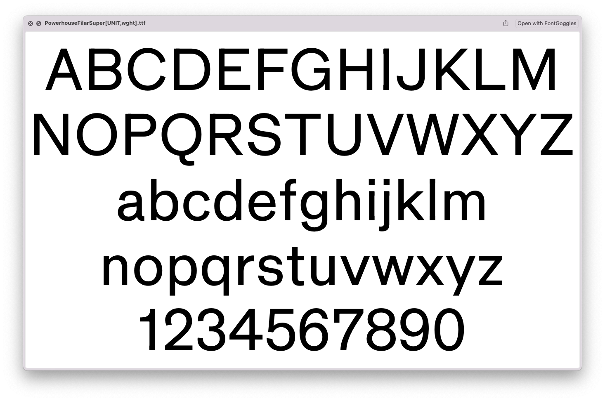

# Powerhouse Filar

Description of your font goes here. We recommend to start with a very short presentation line (the kind you would use on twitter to present your project for example), and then add as much details as necesary :-) Origin of the project, idea of usage, concept of creation… but also number of masters, axes, character sets, etc.

## About

Description of you and/or organisation goes here.

## Building

Fonts are built automatically by GitHub Actions - take a look in the "Actions" tab for the latest build.

If you want to build fonts manually on your own computer:

* `make build` will produce font files.
* `make test` will run [FontBakery](https://github.com/googlefonts/fontbakery)'s quality assurance tests.

## License

This Font Software is licensed under the SIL Open Font License, Version 1.1.
This license is available with a FAQ at
https://scripts.sil.org/OFL